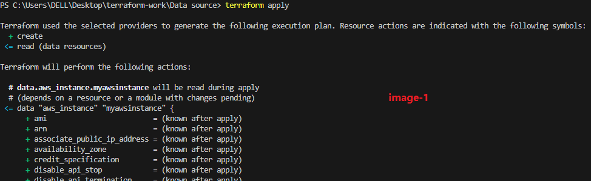
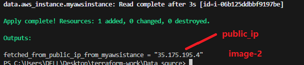
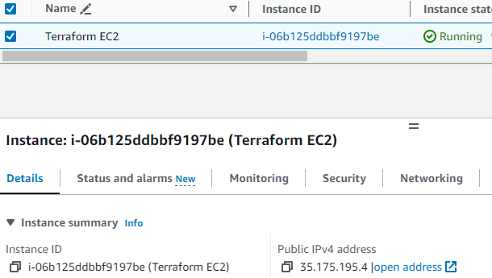
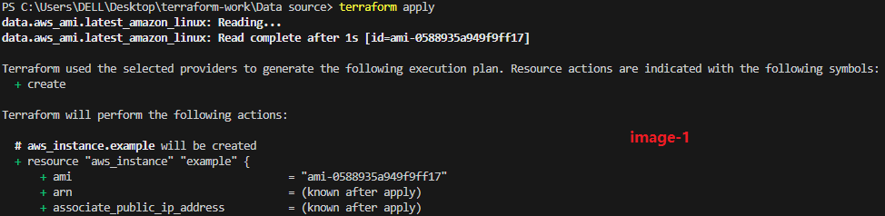
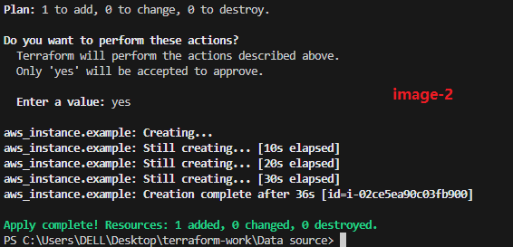
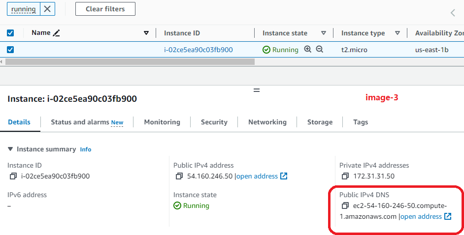

### **Terraform Data Sources**

#### **Overview**
Terraform data sources enable the retrieval and utilization of existing resource information from infrastructure. They allow querying external systems such as cloud provider APIs and using the obtained data dynamically in Terraform configurations.

---

### **Features of Data Sources**
1. **Dynamic Fetching**: Retrieves information from external sources (e.g., AWS, GCP, databases).
2. **Reusable Configurations**: Use fetched data across multiple resources in a dynamic and organized way.
3. **Simplifies Dependency Management**: Use `depends_on` to manage dependencies effectively.

---

### **Basic Syntax**

```hcl
data "provider_resource" "identifier" {
  # Configuration for fetching data
}
```

- **Example**: Querying the latest Amazon Linux AMI
  ```hcl
  data "aws_ami" "latest_amazon_linux" {
    most_recent = true
    owners      = ["amazon"]

    filter {
      name   = "name"
      values = ["amzn2-ami-hvm-*-x86_64-gp2"]
    }
  }

  resource "aws_instance" "example" {
    ami           = data.aws_ami.latest_amazon_linux.id
    instance_type = "t2.micro"
  }
  ```

---

### **Terraform Output Values**

#### **Purpose**
Output values provide a mechanism to display specific resource attributes or data source results on the terminal after Terraform applies a configuration.

#### **Basic Syntax**
```hcl
output "name" {
  value = resource_or_data_source.attribute
}
```

- **Example**: Printing the public IP of an instance
  ```hcl
  output "instance_public_ip" {
    value = data.aws_instance.myawsinstance.public_ip
  }
  ```

---

### **Implementation**

#### **Example 1: Fetching and Printing Instance Data**
```hcl
provider "aws" {
  region = "us-east-1"
}

resource "aws_instance" "myec2" {
  ami           = "ami-0fc5d935ebf8bc3bc"
  instance_type = "t2.micro"

  tags = {
    Name = "Terraform EC2"
  }
}

data "aws_instance" "myawsinstance" {
  filter {
    name   = "tag:Name"
    values = ["Terraform EC2"]
  }

  depends_on = [
    aws_instance.myec2
  ]
}

output "instance_public_ip" {
  value = data.aws_instance.myawsinstance.public_ip
}
```

---

#### **Example 2: Launching Latest Amazon Linux Instance**
```hcl
provider "aws" {
  region = "us-east-1"
}

data "aws_ami" "latest_amazon_linux" {
  most_recent = true
  owners      = ["amazon"]

  filter {
    name   = "name"
    values = ["amzn2-ami-hvm-*-x86_64-gp2"]
  }
}

resource "aws_instance" "example" {
  ami           = data.aws_ami.latest_amazon_linux.id
  instance_type = "t2.micro"
}
```

---

### **Key Points**
1. **Data Sources and Resource Blocks Integration**:
   - Data sources fetch existing information.
   - Resource blocks use that data to provision new resources dynamically.

2. **State Management**:
   - Outputs enhance observability by exposing important attributes for external use or debugging.

3. **Practical Uses**:
   - Querying AMI IDs dynamically.
   - Fetching existing VPC, subnet, or instance details.
   - Displaying results (e.g., IP addresses) for further actions.

---

### **Conclusion**
Both **data sources** and **output values** increase Terraform's flexibility and make configurations reusable and dynamic. By querying external information during runtime and exposing the required attributes, they streamline complex infrastructure provisioning tasks.

---
# Terraform Datasources
- Terraform Datasource it is way of fetch and use existing information or resources from the infrastrucher that we are actually managing 
- it will allow to query the external systems (like cloud providers API databases etc... ad use the obtained data wothin our terraform configuration file )
- we can fetch the data on the providers and use inside terraform file and fetch the data from resource block and providers 
- using Data source we able to pick up information from providers and hold them and use into resource blocks Dynamically 

# Basic Syntax of Datasource

		data "aws_ami" "latest_amazon_linux" {
		  most_recent = true
		  owners      = ["amazon"]

		  filter {
			name   = "name"
			values = ["amzn2-ami-hvm-*-x86_64-gp2"]
		  }
		}

		resource "aws_instance" "example" {
		  ami           = data.aws_ami.latest_amazon_linux.id
		  instance_type = "t2.micro"

		  # other instance configurations...
		}


- From above syntax data block search for amazon linux machine which is latest amazon linux machine
- From above resource block we are using that latest amazon linux machine inside resource block to launch and instance 

- The aws_ami data source queries AWS to find the latest Amazon Linux AMI.
- The resulting AMI information is stored in the data.aws_ami.latest_amazon_linux variable.
- The aws_instance resource then uses the AMI ID obtained from the data source to launch an EC2 instance.  


# Terraform output values

-> using terraform output values we able to print that information on terminal in a flexible way 

        data "aws_instance" "myawsinstance" {
            filter {
            name = "tag:Name"
            values = ["Terraform EC2"]
            }

            depends_on = [
            "aws_instance.ec2_example"
            ]
        } 
                
        output "fetched_info_from_aws" {
            value = data.aws_instance.myawsinstance
        }


- From above basic terraform code in the data source block defining instance to pick and hold on perticular data.aws_instance.myinstance 
- Excute and print those instance information at the time of output block ( suppose like if we reqired public_ip or any image information )

- For to print image public ip 

		output "fetched_info_from_aws" {
			value = data.aws_instance.myawsinstance.public_ip
		}

- from above file it will print public ip of that perticular myawsinstance 

>> Note: Both data sources and output values contribute to the flexibility and reusability of Terraform configurations. Data sources enable you to dynamically fetch information during the planning and provisioning phases, while output values allow you to expose relevant information for further consumption or integration with other systems.

# Implementation 

		provider "aws" {
			region = "us-east-1"
		}

		resource "aws_instance" "myec2" {
			ami           = "ami-0fc5d935ebf8bc3bc"
			instance_type = "t2.micro"

			tags = {
				Name = "Terraform EC2"
			}
		}

		data "aws_instance" "myawsinstance" {
			filter {
				name   = "tag:Name"
				values = ["Terraform EC2"]
			}

			depends_on = [
				"aws_instance.myec2"
				]
			}

			output "fetched_from_public_ip_from_myawsistance" {
				value = data.aws_instance.myawsinstance.public_ip
		}








# Launch an amazon instance 
- below scenario is like launch an instance which is latest one that should amazon only 


		provider "aws" {
			region = "us-east-1"
		}


		data "aws_ami" "latest_amazon_linux" {
			most_recent = true
			owners      = ["amazon"]

			filter {
				name   = "name"
				values = ["amzn2-ami-hvm-*-x86_64-gp2"]
			}
		}
		resource "aws_instance" "example" {
			ami           = data.aws_ami.latest_amazon_linux.id
			instance_type = "t2.micro"

			# other instance configurations...
		}








