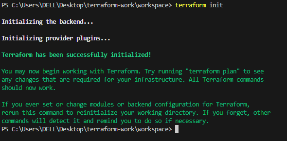
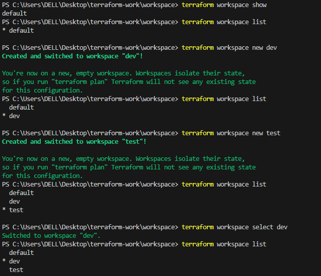
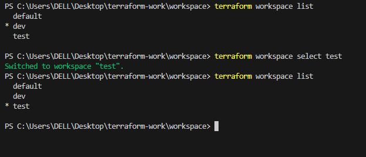
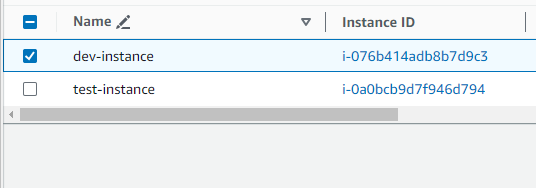
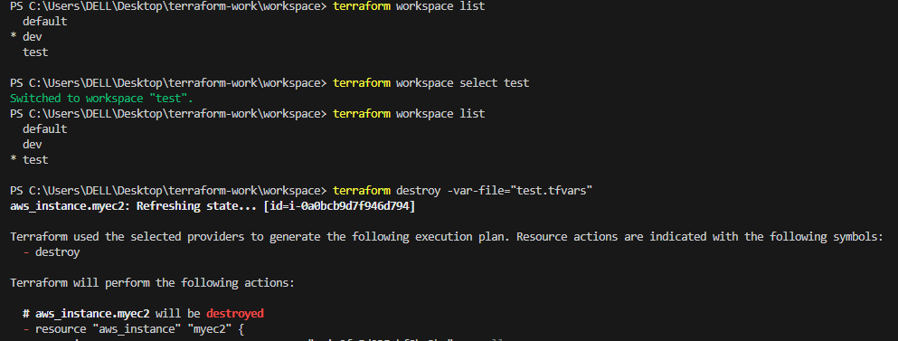

### **Terraform Workspaces**

Terraform Workspaces provide a mechanism to manage multiple environments (e.g., **development**, **testing**, and **production**) using a single configuration file. This concept allows infrastructure for each environment to be isolated while sharing the same `main.tf` file.

---

### **Features of Workspaces**
1. **Environment Segregation**:
   - Each workspace maintains its own state file, enabling isolation between environments.
   - Example: You can create `dev-instances` in the `development` workspace and `test-instances` in the `test` workspace using the same configuration.

2. **Git-Like Workflow**:
   - Similar to branches in Git:
     - Create a "child" workspace for specific tasks.
     - Switch between workspaces to manage resources independently.

---

### **Basic Workspace Commands**

| **Command**                            | **Description**                                                                             |
|----------------------------------------|---------------------------------------------------------------------------------------------|
| `terraform workspace new <name>`       | Creates a new workspace and switches to it.                                                |
| `terraform workspace list`             | Lists all available workspaces.                                                            |
| `terraform workspace show`             | Displays the currently active workspace.                                                   |
| `terraform workspace select <name>`    | Switches to a specified workspace.                                                         |

---

### **Practical Example**

#### **1. Create and Switch Workspaces**
- Create a new workspace:
  ```bash
  terraform workspace new development
  ```
  Output: A new workspace named `development` is created and set as active.

- List available workspaces:
  ```bash
  terraform workspace list
  ```
  Output: Displays all workspaces, with the active workspace highlighted.

- Switch to a different workspace:
  ```bash
  terraform workspace select test
  ```

---

#### **2. Apply Changes in a Workspace**
- Use `-var-file` to specify variables for the workspace:
  ```bash
  terraform apply -var-file="dev.tfvars"
  ```
  This command creates resources based on `dev.tfvars` in the `development` workspace.

---

#### **3. Destroy Resources in a Workspace**
- Destroy infrastructure specific to a workspace:
  ```bash
  terraform destroy -var-file="test.tfvars"
  ```
  This removes resources created in the `test` workspace.

---

### **Workspace State Management**
1. **State Isolation**:
   - Each workspace maintains its own **`terraform.tfstate`** file.
   - Changes in one workspace (e.g., `development`) do not affect resources in another (e.g., `test`).

2. **Default Workspace**:
   - The `default` workspace is created automatically when you initialize Terraform.
   - It is recommended to avoid making major changes in the `default` workspace.

---

### **Use Cases of Workspaces**
1. Managing **Development, Staging, and Production** environments.
2. Isolating resources for **team-specific or project-specific** needs.
3. Testing changes in isolated workspaces without affecting production.

---

Workspaces enhance efficiency and prevent conflicts when managing multiple environments. This feature is particularly helpful for teams following a **multi-environment infrastructure workflow**.

---
### Terraform workspace 
- By help of this terraform workspace using single main.tf file used in differet workspace
- suppose i created dev-instances in developer workspace environmnet and later using that same main.tf file i switched to test workspace and using that main.tf file i created test-instances 
- using workspace concept we able to create multi environments using single main.tf file 
- terraform Workspace it is work like similar to git 
- like in git we are creating child branch and do work on child branch 
- similar like here also 
### Practice  
### To create tarrform workspace

        $ terraform workspace new development
    
> Note:from above command it will create new workspace and automatically moved to that workspace 

### To check How many Workspace to list all workspaces 

        $ terraform workspace list 

### To check active workspaces

        $ terraform workspace show 
    
### To move One workspace to another workspace 

        $ terraform workspace select <workspace name>


### To loging aws cloud 




### workspace commands

 

### To create dev workspace instance on dev workspace 


```
            PS C:\Users\DELL\Desktop\terraform-work\workspace> terraform apply -var-file="dev.tfvars"

            Terraform used the selected providers to generate the following execution plan. Resource actions are indicated with the following symbols:
            + create

            Terraform will perform the following actions:

            # aws_instance.myec2 will be created
            + resource "aws_instance" "myec2" {
                + ami                                  = "ami-0fc5d935ebf8bc3bc"
                + arn                                  = (known after apply)    
                + associate_public_ip_address          = (known after apply)    
                + availability_zone                    = (known after apply)
                + cpu_core_count                       = (known after apply)
                + cpu_threads_per_core                 = (known after apply)
                + disable_api_stop                     = (known after apply)
                + disable_api_termination              = (known after apply)
                + ebs_optimized                        = (known after apply)
                + get_password_data                    = false
                + host_id                              = (known after apply)
                + host_resource_group_arn              = (known after apply)
                + iam_instance_profile                 = (known after apply)
                + id                                   = (known after apply)
                + instance_initiated_shutdown_behavior = (known after apply)
                + instance_lifecycle                   = (known after apply)
                + instance_state                       = (known after apply)
                + instance_type                        = "t2.micro"
                + ipv6_address_count                   = (known after apply)
                + ipv6_addresses                       = (known after apply)
                + key_name                             = (known after apply)
                + monitoring                           = (known after apply)
                + outpost_arn                          = (known after apply)
                + password_data                        = (known after apply)
                + placement_group                      = (known after apply)
                + placement_partition_number           = (known after apply)
                + primary_network_interface_id         = (known after apply)
                + private_dns                          = (known after apply)
                + private_ip                           = (known after apply)
                + public_dns                           = (known after apply)
                + public_ip                            = (known after apply)
                + secondary_private_ips                = (known after apply)
                + security_groups                      = (known after apply)
                + source_dest_check                    = true
                + spot_instance_request_id             = (known after apply)
                + subnet_id                            = (known after apply)
                + tags                                 = {
                    + "Name" = "dev-instance"
                    }
                + tags_all                             = {
                    + "Name" = "dev-instance"
                    }
                + tenancy                              = (known after apply)
                + user_data                            = (known after apply)
                + user_data_base64                     = (known after apply)
                + user_data_replace_on_change          = false
                + vpc_security_group_ids               = (known after apply)
                }

            Plan: 1 to add, 0 to change, 0 to destroy.

            Do you want to perform these actions in workspace "dev"?
            Terraform will perform the actions described above.
            Only 'yes' will be accepted to approve.

            Enter a value: yes

            aws_instance.myec2: Creating...
            aws_instance.myec2: Still creating... [10s elapsed]
            aws_instance.myec2: Still creating... [20s elapsed]
            aws_instance.myec2: Still creating... [30s elapsed]
            aws_instance.myec2: Creation complete after 37s [id=i-076b414adb8b7d9c3]

            Apply complete! Resources: 1 added, 0 changed, 0 destroyed.
            PS C:\Users\DELL\Desktop\terraform-work\workspace> 

```


### Now switch to test workspace 
```
terraform workspace select test 
``` 



```
            PS C:\Users\DELL\Desktop\terraform-work\workspace> terraform apply -var-file="test.tfvars"    

            Terraform used the selected providers to generate the following execution plan. Resource actions are indicated with the following symbols:
            + create

            Terraform will perform the following actions:

            # aws_instance.myec2 will be created
            + resource "aws_instance" "myec2" {
                + ami                                  = "ami-0fc5d935ebf8bc3bc"
                + arn                                  = (known after apply)    
                + associate_public_ip_address          = (known after apply)    
                + availability_zone                    = (known after apply)    
                + cpu_core_count                       = (known after apply)    
                + cpu_threads_per_core                 = (known after apply)    
                + disable_api_stop                     = (known after apply)    
                + disable_api_termination              = (known after apply)    
                + ebs_optimized                        = (known after apply)    
                + get_password_data                    = false
                + host_id                              = (known after apply)    
                + host_resource_group_arn              = (known after apply)    
                + iam_instance_profile                 = (known after apply)    
                + id                                   = (known after apply)    
                + instance_initiated_shutdown_behavior = (known after apply)    
                + instance_lifecycle                   = (known after apply)    
                + instance_state                       = (known after apply)    
                + instance_type                        = "t2.micro"
                + ipv6_address_count                   = (known after apply)    
                + ipv6_addresses                       = (known after apply)    
                + key_name                             = (known after apply)    
                + monitoring                           = (known after apply)    
                + outpost_arn                          = (known after apply)    
                + password_data                        = (known after apply)    
                + placement_group                      = (known after apply)
                + placement_partition_number           = (known after apply)
                + primary_network_interface_id         = (known after apply)
                + private_dns                          = (known after apply)
                + private_ip                           = (known after apply)
                + public_dns                           = (known after apply)
                + public_ip                            = (known after apply)
                + secondary_private_ips                = (known after apply)
                + security_groups                      = (known after apply)
                + source_dest_check                    = true
                + spot_instance_request_id             = (known after apply)
                + subnet_id                            = (known after apply)
                + tags                                 = {
                    + "Name" = "test-instance"
                    }
                + tags_all                             = {
                    + "Name" = "test-instance"
                    }
                + tenancy                              = (known after apply)
                + user_data                            = (known after apply)
                + user_data_base64                     = (known after apply)
                + user_data_replace_on_change          = false
                + vpc_security_group_ids               = (known after apply)
                }

            Plan: 1 to add, 0 to change, 0 to destroy.

            Do you want to perform these actions in workspace "test"?
            Terraform will perform the actions described above.
            Only 'yes' will be accepted to approve.

            Enter a value: yes

            aws_instance.myec2: Creating...
            aws_instance.myec2: Still creating... [10s elapsed]
            aws_instance.myec2: Still creating... [20s elapsed]
            aws_instance.myec2: Still creating... [30s elapsed]
            aws_instance.myec2: Creation complete after 38s [id=i-0a0bcb9d7f946d794]

            Apply complete! Resources: 1 added, 0 changed, 0 destroyed.
            PS C:\Users\DELL\Desktop\terraform-work\workspace> 
```


### Now destroying instances 





